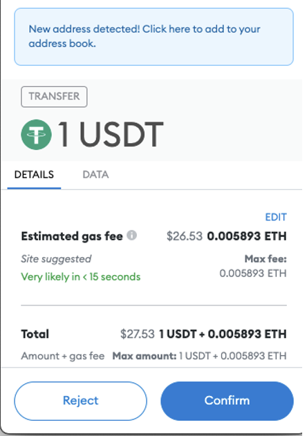

## 👩‍🔬 成為超級使用者
---

**在 web3 生態系統中開始作為開發人員的第一步是首先成為高級用戶！**  

**你因該從動手及使用工具開始，讓你得到更深入了解你你可以做什麼和加密領域的全部內容**  

**在這個章節,我們將說到一些加密領域工具的使用，並幫助大家成為 Ethereum 超級使用者。**  

## Day 2:  Wallets

#### Crypto Wallets

**作為一個使用者，全部的開始都是始於一個加密錢包，它允許你和區塊鏈建立連結。它為您提供了與加密貨幣交互所需的工具。**  

**加密錢包生成私鑰和公鑰。加密錢包的主要功能是存儲密鑰和簽署交易。**  

- 🔓 **公鑰**，顧名思義，是公開的。如果您向某人提供您的公共地址，他們可以向您發送加密貨幣。 

- 🔐 **私鑰**就像您的密碼。您應該妥善保管，切勿與任何人分享。任何擁有您私鑰的人都可以完全訪問您的錢包。這個數字很難記住和存儲；這就是助記詞的用武之地。它是從私鑰生成的短語，人類可讀且更易於存儲。 

有託管錢包和非託管錢包。  

-  **託管錢包**：第三方（通常是 Coinbase、Binance 或 Robinhood 等交易所）擁有您的私鑰並代表您簽署交易。您信任第三方持有您的密鑰並向他們提供您的信息。 

-  **非託管錢包**：用戶擁有私鑰；中間沒有第三方。因此，用戶是唯一擁有私鑰和/或種子短語的人；沒有其他人應該知道這些信息。 

在託管錢包上，您的功能有限。你可以做平台允許你做的事情，主要是買賣幣/代幣。然而，當你想玩加密遊戲時，這通常是不可能的。 

🌟 最受歡迎的非託管加密錢包之一是 [ Metamask ](https://metamask.io/)，前往該網站設置您的錢包。另一個流行的錢包是[ Rainbow ](https://rainbow.me/)，這是一款手機錢包。

設置 Metamask 後，您可以在頂部看到您的公共地址。這就像您的銀行帳號；這是一個公共帳號，您可以共享它來接收資金。 

#### 交易

你在以太坊上所做的一切都是交易。例如，
當您將一些代幣從一個帳戶發送到另一個帳戶時，它將作為交易添加到分類帳中。

[ Etherscan ](https://etherscan.io/) 是以太坊的區塊瀏覽器，它記錄所有交易並以簡單的方式顯示它們。

#### Gas Fee

進行轉賬會產生交易費。這稱為 [Gas Fee](https://ethereum.org/en/developers/docs/gas/) 區塊鏈上的每筆交易都有成本。所以當你想要發送代幣時，你需要支付稱為 gas fee 的價格。Gas是表示交易成本的單位度量。  

這裡有一點需要補充（下圖）可以看到如果是轉 USDT 其手續費也是 ETH。 

在以太坊上，Gas Fee 以 ETH 支付並以 gwei 表示。  
這邊幫大家整理一下常看到的名詞
| Gas Fee   | 交易手續費 |                           |   |   |   |   |   |   |   |
|-----------|-------|---------------------------|---|---|---|---|---|---|---|
| Gas Price | 燃料價格  | 就每單位 Gas 願意付出多少 ETH  ，當然付越多速度有機會比較快     |   |   |   |   |   |   |   |
| Gas Limit | 燃料限制  | 一般標準交易的 Gas Limit 為21000 |   |   |   |   |   |   |   |
| Gas Used  | 燃料使用  |                           |   |   |   |   |   |   |   |

這裡有個小常識

- 預估交易費 = Gas Limit x Gas Price
- 實際交易費 = Gas Used x Gas Price
###  🥅 目標
- [v] 設置一個 metamask 錢包
- [v] 將測試網絡添加到元掩碼
- [v] 獲取一些測試網 ETH

**可交付成果**
- [v] 向您發送測試網交易
- [v] 將您的錢包地址發送到其他地址

 

可參考說明[影片](https://www.youtube.com/watch?v=_GjPeRLCREA&list=PLJz1HruEnenAf80uOfDwBPqaliJkjKg69&index=3)
