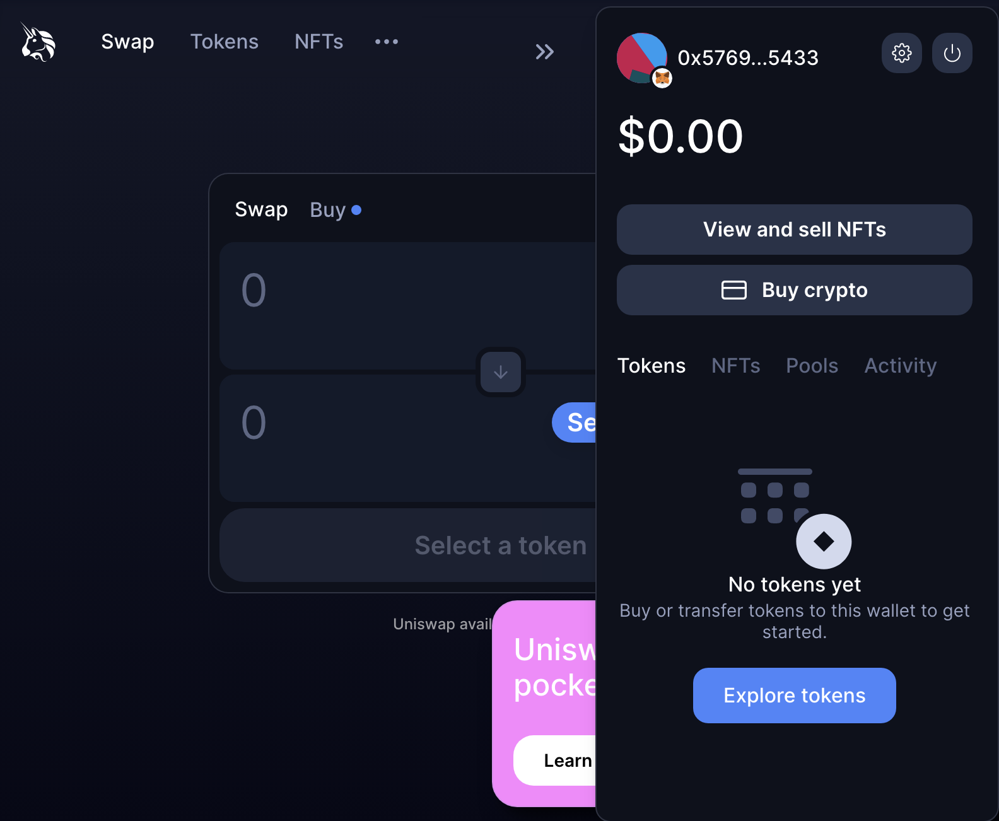
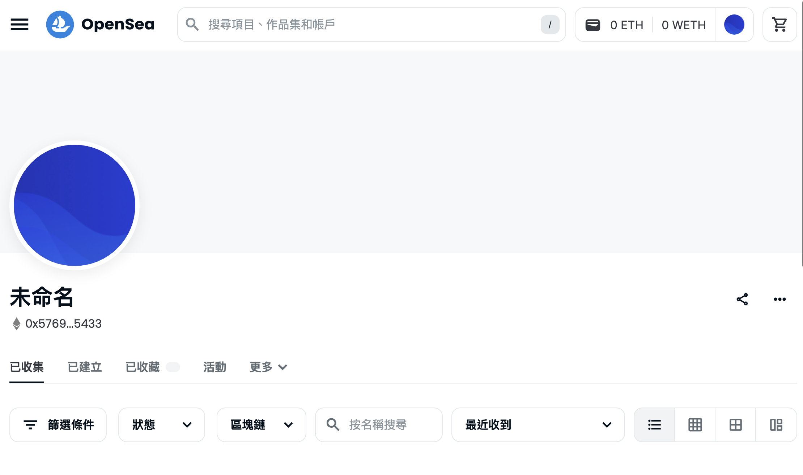
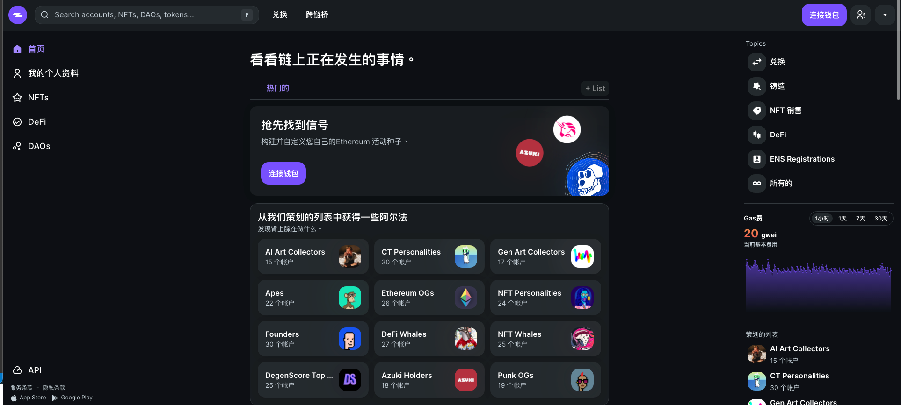

## Day 3: ENS, DEX, Identity, Inventory, Sybil

#### Decentralized App(dApp)

dapp 就像是軟體應用程式-的網站或者是手機應用程式。 
不同之處在於後端的程式碼跑再去中心化網路，例如 peer-to-peer(點對點) 網路或區塊鏈，所以一個應用程式再乙太訪上就是一個 dapp。 
使用我們自己擁有的錢包來升級 web3 服務，我們的身份與清單跟隨著一個應用到一個應用(超級酷！！)
舉例就是，只要連接一個錢包應用都可以使用如下圖。 

#### ENS 

錢包地址是由 42個字符16進位地址，很遺憾的是這對於人類來說非常難記憶  
這就是 [Ethereum Name Service (ENS)](https://ens.domains/) 的用武之地，這是一個建立在 以太坊的查找服務. DNS 取得 IP 地址後映射到人類世界的域名; NES 取得虛擬貨幣的地址映射到人類世界的字串  
EX: 142.251.42.227 -> google.com.tw  
EX: x0ae8hbkella...abc ->0xRoryyyy.eth  

當你需要轉錢錢到你的帳號時，你會傳送 ENS的名稱而不會是寄攏長即複雜的地址，'name.eth' 就是一個範例。你可以把這個發給某人，然後他可以傳送 coins/tokens 再以太坊上，這提供了一個基本的身份形式。  

你可以提交給你自己一個 ENS 從 [app](https://app.ens.domains/)，也可以在 Etherscan 上搜索 ENS 並查看交易。 
[可以試著申請 Test ENS](https://hackmd.io/@jlUcRpm-QcOwe2cxBxjf4w/ByV1YW0gj)

#### Decentrazlized Exchange & Centralized Exchange 

- **集中式交易所**：由一個實體擁有的交易所。它們允許您買賣加密貨幣。 Coinbase、Binance 和 Robinhood 是集中式交易平台的流行示例。

- **去中心化交易所**：允許點對點加密貨幣交易的交易所。沒有中介。相反，它基於智能合約。 [Uniswap](https://uniswap.org/) 是以太坊區塊鏈上的去中心化交易所。它是最受歡迎的加密貨幣交易平台之一。 

注意硬幣和令牌之間的區別也很重要。 

- **硬幣** 存在於自己的區塊鏈上。它是該區塊鏈貨幣的數字表示。 BTC、ETH 或 SOL 是加密貨幣；他們每個人都有自己的區塊鏈。

- **令牌** 通過智能合約在現有區塊鏈之上運行。 NFT 是一種代幣。基本上，硬幣有自己的區塊鏈並用作交換媒介，而代幣存在於區塊鏈之上並且可以具有不同的價值或效用。

#### ERC 20

**ERC-20** 是在以太坊區塊鏈上創建可替代代幣的智能合約標準。 ERC代表“Ethereum request for comment”，20是代幣標識符。

p.s. ERC全名為Ethereum Request for Comments，由於ERC所要討論的範圍是"應用程式層級的標準和協定"

DAI 是一種 ERC20 代幣，是一種穩定幣。你可以在這裡閱讀 DAI 的工作原理
 [here](https://docs.makerdao.com/getting-started/maker-protocol-101)

ERC智能合約比較多。例如，創建不可替代令牌（NFT）的標準是 ERC-721。

### 🥅 Goals
- [ ]  到ENS 申請你的 ENS Name
- [ ]  去看看 Uniswap 
- [ ]  去看看 (Zapper.fi)[https://zapper.xyz/zh] 

**Deliverables**
- [ ] 利用 ENS 送出交易.
 
可參考說明[影片](https://www.youtube.com/watch?v=wYSMNdIRoII)