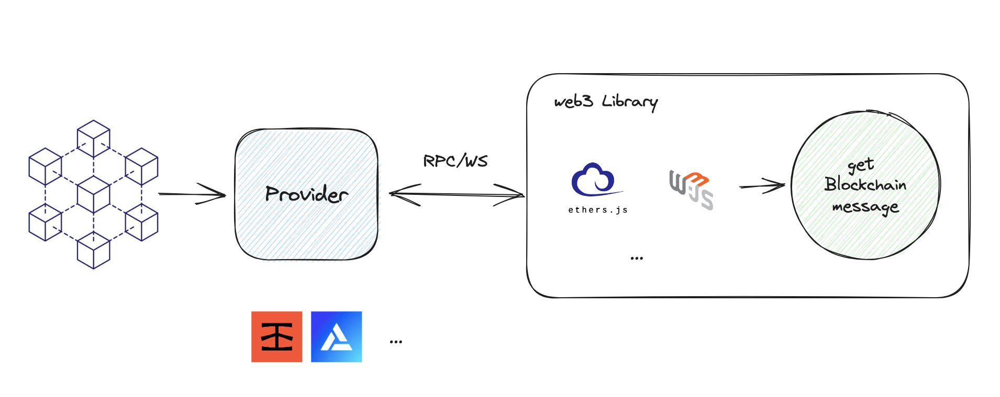
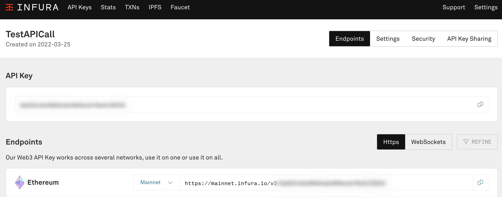
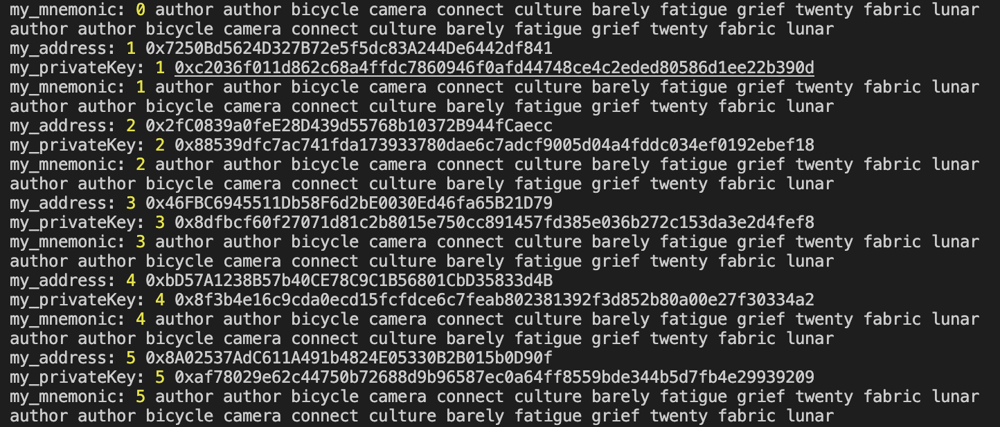

### Providers, Signers, Wallets & Scripting with ethers.js
### 使用 ethers.js 腳本控制，Providers, Signers, Wallets

```
  // 切換版本
  nvm use v18.16.0
  // init nodejs
  npm init
  // 安裝
  npm install ethers dotenv
  // 測試
  node provider.js 
```
# provider.js
  要先設定 Provider，才能進行後續的操作。下面是示意圖

  - ethers.AnkrProvider
  - ethers.InfuraProvider
  - ethers.PocketProvider
  - ethers.StaticJsonRpcProvider
  - 可以參考
    https://docs.ethers.org/v6/api/providers/thirdparty/

  #### 通常我們會使用 InfuraProvider，因為它是免費的（正常的請流量）。
  #### 但會建議去 https://app.infura.io/ 申請一個 key
  
  #### 當然如果你要透過這樣的供應商，建議是找比較好或較好的供應商。

  ####  v6 寫法請直接參考官方文件
  ####  v5 -> ethers.providers.JsonRpcProvider(infuraUrl);
  ####  v6 -> ethers.JsonRpcProvider(infuraUrl);

#### 非常建議把一些隱密性的訊息放到環境變數去
```
const infuraId = process.env.INFURA_ID;
const infuraUrl = `https://mainnet.infura.io/v3/${infuraId}`;
// 下面兩種方法都可以
const provider = new ethers.JsonRpcProvider(infuraUrl);
const providerInfur = new ethers.InfuraProvider('homestead', infuraId);
```
#### 這邊我們可以看到，我們可以透過 provider 來取得我們想要的資訊。
```
const blocknumber = await provider.getBlockNumber();
console.log('Current block Number.', blocknumber);
```


ens -> address
```
const address = await provider.resolveName("0xroryyy.eth");
console.log('0xroryyy.eth is', address);
```
address -> ens
```
const ensName = await provider.lookupAddress(address);
console.log('0xbFc14BC72590eB653AF0873d3401Fac602942Ad3 is ', ensName);
```
#### 目前金額 可以看到，其實你使用 address or ensName 都可以。
#### 單位是 BigNumber
#### 可以參考 https://docs.ethers.org/v6/migrating/#migrate-bigint
```
const addressBalance = await provider.getBalance(address);
const ensBalance = await provider.getBalance(ensName);
console.log('addressBalance', addressBalance.toString());
console.log('ensBalance', ensBalance.toString());
```
#### 不過我們因該是看不懂這個數字畢竟區塊鏈的單位不太一樣。
#### 記得使用單位轉換 formatEther 是真的能看懂的格式
```
console.log(ethers.formatEther(addressBalance));
console.log(`${ethers.parseEther('1.0').toString()} wei`);
```
#### 可以直接比對
```
if (addressBalance > ethers.parseEther('0.01')) {
  console.log('大於 1 ETH');
}
#### 可以數字相加
console.log(addressBalance + ethers.parseEther('1'));
#### 總之如果要計算金額建議 轉換成eth的單位在做計算
```

# wallets.js


#### 建立錢包
```
const wallet = await ethers.Wallet.createRandom();
console.log('address:', wallet.address); //地址
console.log('privateKey:', wallet.privateKey); //私鑰
console.log('mnemonic:', wallet.mnemonic.phrase); //註記詞
```
#### 用這的的方法會發現註記詞都一樣，但地址不同
#### 但實際上你導入 狐狸錢包那是不可行的 哈哈他一樣只會給你顯示一個
```
let path, myWallet;

for (let index = 0; index < 10; index++) {
  path = `m/44'/60'/0'/0/${index}`;
  console.log(wallet.mnemonic.phrase)
  myWallet = ethers.HDNodeWallet.fromMnemonic(wallet.mnemonic, path);
  console.log('my_address:', index, myWallet.address);
  console.log('my_privateKey:', index, myWallet.privateKey);
  console.log('my_mnemonic:', index, myWallet.mnemonic.phrase);
}
```

#### 連結寫法
```
const infuraId = process.env.INFURA_ID;
const infuraUrl = `https://mainnet.infura.io/v3/${infuraId}`;
const provider = new ethers.JsonRpcProvider(infuraUrl);

let bbb = await provider.getBlockNumber();
console.log(bbb);
// 這裡記得私鑰要自己保管好，不然就會被盜走了。然後也放到環境變數
//console.log(process.env.MY_WALLET_KEY);
// 連結寫法
// wallect.connect(provider); 寫法 1
const wallect = new ethers.Wallet(process.env.MY_WALLET_KEY, provider); // 寫法 2 （建議）
console.log(wallect);

```

#### 簽章訊息
```
let signature = await wallect.signMessage('Hola!')
console.log('Sign message: ', signature);
// 驗證
console.log('verifyMessage: ', ethers.verifyMessage('Hola!', signature));
```

#### 傳送交易
```
const toAddress = await provider.resolveName("0xroryyy.eth");
// 傳送交易
const tx = await wallect.sendTransaction({
  to: toAddress,
  value: ethers.parseEther('0.001'), // 這裡記得要轉換成 wei
});

console.log('send tx ', tx);
await tx.wait(); // 等待交易完成

console.log('tx complete');
```


影片出處
https://www.youtube.com/watch?v=m2AJAcWk394

[⬇️ Day2](../Day2/README.md) \
[🏰 回首頁](../../../README.md)