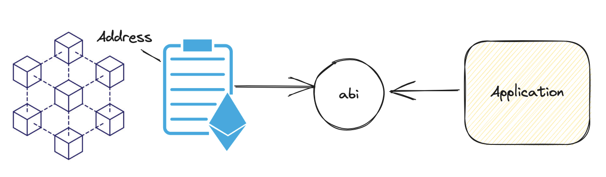
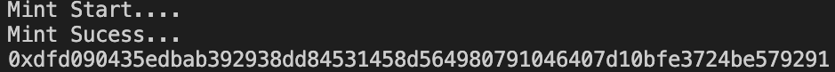
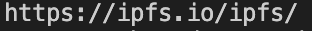

###  Reading and Writing to Contracts with Ethers.js 
### 使用 Ethers.js 讀取和寫入合約


可以先領一下水龍頭，我們使用的是 ETH sepolia 測試網路
- https://www.infura.io/faucet/sepolia
- https://faucets.chain.link/

本章節我改變了一下流程，先讓大家熟悉 ethers.js 的使用，再來寫一個簡單的合約，最後再來寫一個簡單的 Dapp
當然都是取至 Becoming A Power User 一系列課程。


首先養成良好的習慣建立常用的 utils，所以我們建立一個 utils.js

## utils.js
```js
import 'dotenv/config';
import { ethers } from 'ethers';

// 新增 測試網 和 正式網設定切換 function
const getProvder = (mainnet = false) => {
  const infuraId = process.env.INFURA_ID;
  const provderUrl = mainnet
    ? `https://mainnet.infura.io/v3/${infuraId}`
    : `https://sepolia.infura.io/v3/${infuraId}`


  //console.log('provderUrl', provderUrl);
  return new ethers.JsonRpcProvider(provderUrl);

}

// const provder = getProvder();
// // 印出來目前的網路
// const network = await provder.getNetwork();
// 印出 JSON 格式
// console.log('network', network.toJSON());


const generateWallet = () => {
  const wallet = ethers.Wallet.createRandom();
  // 請注意我們建立錢包的時候絕對不會呈現出來私鑰，這是非常不安全的
  // 這裡只是為了方便大家看到結果，所以才會印出來
  // 請記得養成好習慣
  //console.log('address:', wallet.address); //地址
  //console.log('privateKey:', wallet.privateKey); //私鑰
  // console.log('mnemonic:', wallet.mnemonic.phrase); //註記詞
}

//generateWallet();

const getSigner = (mainnet = false) => {
  const provder = getProvder();
  return new ethers.Wallet(process.env.MY_WALLET_KEY, provder);
};
// 取得簽名持有扯
//const signer = getSigner();
// 呈現地址
//console.log('signer', await signer.getAddress());

// signer 就像用你的私鑰去讓別人認識你，而 connect 是連線到網路去singer在取得資料


export { getProvder, generateWallet, getSigner }
```

先簡單的測試一下，然後我們寫一個 SendEth.js 來測試一下
## SendEth.js
```js
import 'dotenv/config';
import { ethers } from 'ethers';
import { getProvder, getSigner } from './utils.js';

const sepoliaProvider = getProvder();
const sepoliaSinger = getSigner();

const address = await sepoliaSinger.getAddress();

console.log('address', address);
// ethers v6 明確分開singiner 和 provider, singiner EIP-721
const myBalance = await sepoliaProvider.getBalance(address);

// 人看得懂的格式 ethers.formatEther
console.log('myBalance', ethers.formatEther(myBalance));
// 這裡又特別慎重的表示不要將您的 註記詞與私鑰透露。
// //const toAddress = await provider.resolveName("xxxxx.eth");
// // 傳送交易
const tx = await sepoliaSinger.sendTransaction({
  to: process.env.SEND_WALLET,
  value: ethers.parseEther('0.001'), // 這裡記得要轉換成 wei
});

console.log('send tx ', tx);
await tx.wait(); // 等待交易完成

console.log('tx complete');

```

`signer 就像用你的私鑰去讓別人認識你 （會可以交易），而 Provider 是連線到網路去singer在取得資料`


## Reading and Writing to Contracts 

最重要的部分來拉！！

這邊我先使用後續會用到的合約，所以我們先來看一下合約的部分

### YourCollectible.sol
```js
// SPDX-License-Identifier: MIT
pragma solidity ^0.8.17;

import "@openzeppelin/contracts/token/ERC721/ERC721.sol";
import "@openzeppelin/contracts/token/ERC721/extensions/ERC721URIStorage.sol";
import "@openzeppelin/contracts/access/Ownable.sol";
import "@openzeppelin/contracts/utils/Counters.sol";

contract YileBaccaratChain is ERC721, ERC721URIStorage, Ownable {
    using Counters for Counters.Counter;

    Counters.Counter private _tokenIdCounter;

    constructor() ERC721("YourCollectible", "YBC") {}

    function safeMint(address to, string memory uri) public onlyOwner {
        uint256 tokenId = _tokenIdCounter.current();
        _tokenIdCounter.increment();
        _safeMint(to, tokenId);
        _setTokenURI(tokenId, uri);
    }

    // The following functions are overrides required by Solidity.

    function _burn(uint256 tokenId) internal override(ERC721, ERC721URIStorage) {
        super._burn(tokenId);
    }

    function getCurrent() public view returns(uint256) {
        return _tokenIdCounter.current();
    }

    function tokenURI(uint256 tokenId)
        public
        view
        override(ERC721, ERC721URIStorage)
        returns (string memory)
    {
        return super.tokenURI(tokenId);
    }

    function supportsInterface(bytes4 interfaceId)
        public
        view
        override(ERC721, ERC721URIStorage)
        returns (bool)
    {
        return super.supportsInterface(interfaceId);
    }
}
```

這是一個簡易的 ERC721 合約，我們可以透過 mintItem 來創建一個 ERC721 的 NFT，並且可以透過 getCurrent 來取得目前的 NFT 目前的 ID，這邊先不深入說明裡面內容。

- 目前部署在 sepolia 上，可直接練習
  0xCcB88EE64cc6B0C50430fd49F1c7144eAf8323A1

https://sepolia.etherscan.io/address/0xccb88ee64cc6b0c50430fd49f1c7144eaf8323a1


讓我們開始吧
### contract Read

這裡最重要的是如何綁定合約並讀取到如下圖


`可從圖中看出來智能合約和應用程式間必須透過 "abi" 來溝通`

[前往查看 abi](./abi/NFT.js) 

會看到下面的格式
```js
  {
    "inputs": [ // 輸入
      {
        "internalType": "address",
        "name": "to",
        "type": "address"
      },
      {
        "internalType": "uint256",
        "name": "tokenId",
        "type": "uint256"
      }
    ],
    "name": "approve", // 呼叫方法名稱
    "outputs": [],
    "stateMutability": "nonpayable",
    "type": "function"
  },
```

## contract_red.js

```js
import 'dotenv/config';
import { ethers } from 'ethers';
import sanfordNFTABI from './abi/NFT.js';
import { getProvder, getSigner } from './utils.js';
const sanfordNFTAddress = "0xCcB88EE64cc6B0C50430fd49F1c7144eAf8323A1";
const sepoliaSinger = getSigner();

const Contract = new ethers.Contract(sanfordNFTAddress, sanfordNFTABI, sepoliaSinger);

const _currentId = await Contract.getCurrent();
console.log('_currentId', _currentId);
```
說明一下
1. 給定合約地址 0xCcB88EE64cc6B0C50430fd49F1c7144eAf8323A1
2. 給定合約 ABI
3. 給定 signer
4. 透過 ethers.Contract 來綁定合約
5. 透過 Contract.getCurrent() 來取得目前的 NFT 目前的 ID

Contract.getCurrent() Result:\


### contract Write

## contract_write.js

```js
import 'dotenv/config';
import { ethers } from 'ethers';
import sanfordNFTABI from './abi/NFT.js';
import { getSigner } from './utils.js';
const sanfordNFTAddress = "0xCcB88EE64cc6B0C50430fd49F1c7144eAf8323A1";
const sepoliaSinger = getSigner();

const Contract = new ethers.Contract(sanfordNFTAddress, sanfordNFTABI, sepoliaSinger);

console.log('Mint Start....');
const Tx = await Contract.safeMint(await sepoliaSinger.getAddress(), 'https://ipfs.io/ipfs/');

console.log('Mint Sucess...');

console.log(Tx.hash);

const url = await Contract.tokenURI(0);
console.log(url);
```

說明一下
1. 給定合約地址 0xCcB88EE64cc6B0C50430fd49F1c7144eAf8323A1
2. 給定合約 ABI
3. 給定 signer
4. 透過 ethers.Contract 來綁定合約
5. 透過 Contract.safeMint 來創建一個 ERC721 的 NFT
6. 透過 Contract.tokenURI 來取得 NFT 的 URI (測試一下)

Contract.safeMint Result:\

Contract.tokenURI:\


大概是 Week2-Day2 的簡要紀錄。

影片出處
https://www.youtube.com/watch?v=9qt35swYSUg

[⬆️ Day1](../Day1/README.md) \
[🏰 回首頁](../../../README.md)