###  Intro to Ethereum Clients & Hardhat
### 以太坊客戶端 ＆ Hardhat 簡介
---

### Ethereum Clients

乙太坊網路其實是點對點的，所以他的存在就一定要有節點（Node)

大家都知道區塊鏈是超級帳簿，也就是說每一個點都會有一份完整的帳簿，所以每一個節點都是一個完整的區塊鏈。

其實以太坊客戶端就是一個可以讓你與以太坊區塊鏈互動的軟體，你可以透過它來發送交易、部署合約、讀取合約資料等等。

所以我們可以練習一下架設節點，我們使用的是 Geth 這個以太坊客戶端，他是用 Go 語言寫的，所以他的名字叫 Geth。

我是使用MacOS，所以我們可以透過 Homebrew 來安裝 Geth。輸入下指令：

```js
brew install ethereum
```
安裝後數入指令：

```js
geth --syncmode light --http --http.addr 0.0.0.0
```

我們設定同步方式為 light 模式（這同步會需要一點時間，不是立刻建立都同步了...現在網路巨大可能還是要同步一段時間)

但如果你啟動後，是可以操作的。

我們看一下 infura va local,number 極大的差距啊！！

寫個測試程式

### [provider.js](./provider.js)
```js
import 'dotenv/config';
import { ethers } from 'ethers';

const infuraId = process.env.INFURA_ID;

const localNode = `http://127.0.0.1:8545`;
const infuraUrl = `https://mainnet.infura.io/v3/${infuraId}`;

const infuraProvider = new ethers.JsonRpcProvider(infuraUrl);
const provider = new ethers.JsonRpcProvider(localNode);

// 這邊我們可以看到，我們可以透過 provider 來取得我們想要的資訊。
const infura_blocknumber = await infuraProvider.getBlockNumber();
console.log('Current infura block Number.', infura_blocknumber);
const blocknumber = await provider.getBlockNumber();
console.log('Current block Number.', blocknumber);
// 測試利用本地節點來解析名稱
const address = await provider.resolveName('xxxx.eth');
console.log('xxxx.eth ', address);

```

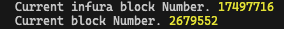

這裡要補充一下其實 客戶端的節點有些模式

-   Full node
    -   儲存完整的區塊鏈數據
    -   參與區塊驗證，並驗證全部的區塊狀態
    -   為網路提供服務，並根據要求提供數據
-   Light node

    -   輕節點不是下載每個塊，而是下載塊頭，這些標頭僅包含有關塊內容的摘要資訊。
    -   無法參與驗證，但他可以訪問或與完整節點訪問乙太坊
    -   不需要強大的網路和硬體，所以可以在手機或嵌入式設備上運行

-   Archive node
    -   這種節點比較需要知道區塊或交易才能查詢
    -   儲存保存完整節點的所以內容，並建構歷史狀態存擋。
    -   然而這個節點是以 TB 單位，所以可能一般的 client 會比較少選擇這總方式，但是對於錢包提供商或鏈上分析單位通常會這樣使用。

（如果本地同步完了，有可能還會比 infura 還快 哈哈）

不過我們在這裡就會看到一點，你建立了節點你只是可以取得資料，就算是要做認證也是要使用也是要和別人一起認證才能決定（超去中心化的啊！！）

這裡很淺的介紹，要學習其實也是需要一點時間～

# Hardhat

為什麼要使用 Harhat 因為有的時候開發的時候並不會想要直接在網路上開發

當然還是需要本地的環境，所以現在來介紹一下吧

## 如何安裝

```js
    nvm use v18.12.1
    npm install hardhat

```

```js
    npx hardhat --version // 測試版本
```
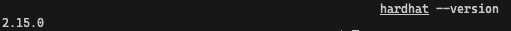
## 建立專案

```js
    npx hardhat
```
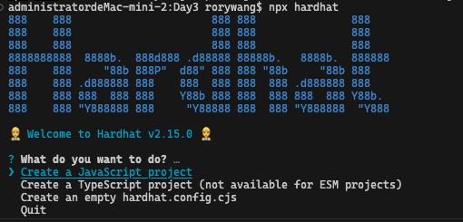

step1. 會問你要怎麼建立

-   Create a JavaScript project `javascript 專案`
-   Create a TypeScript project (not available for ESM projects) `typescript 專案`
-   Create an empty hardhat.config.cjs `一個空的設定檔.. 🎃🎃🎃🎃🎃`

step2. Hardhat project root: `建在哪個path`

step3. Do you want to add a .gitignore `是不是要設定 .gitignore`

step4. Do you want to install this sample project's dependencies with npm (@nomicfoundation/hardhat-toolbox)? `要不要安裝基礎的 hardhart 套件`
(建議是裝一下)

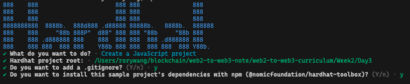

step5. 安裝完成

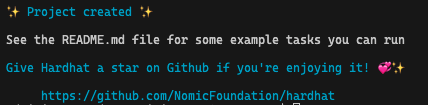
## 目錄結構

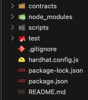

-   contracts 合約放的地方
-   script 需要部署的或執行
-   test 測試
-   hardhat.config.js hardhat 設定檔都在這

## 啟動節點

這裡我們可以在本地端啟動我們的本地節點（起記得這就是開發的節點）

```js
    npx hardhat node
```

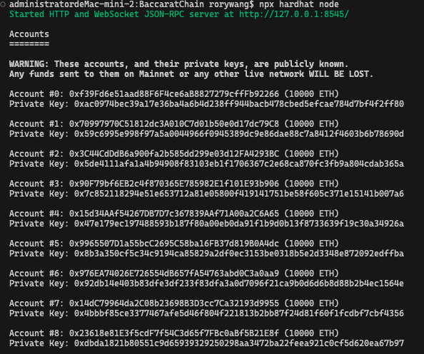

-   啟動節點 http://127.0.0.1:8545/
-   給 20 個 帳號 .... 都 10000 ETH 🙀

## 寫智能合約

這裡我們沿用一下 [YourCollectible.sol](../Day2/contracts/YourCollectible.sol)

貼上就好 😹 輸入

```js
npx hardhat compile
```
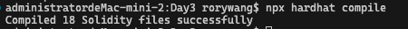

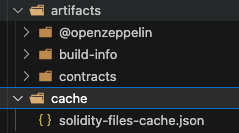

編譯一下合約，會看到產生出一些套件，實際上這裡產生的其實是會用到的套件和 abi 等等.

## 部署本地 hardhat

\
首先我們到 scripts/deploy.js ，貼上代碼:

```js
const hre = require('hardhat');

async function main() {
	const YourCollectible = await hre.ethers.getContractFactory(
		'YourCollectible'
	);
	await YourCollectible.deploy();
	console.log(YourCollectible);
}

// We recommend this pattern to be able to use async/await everywhere
// and properly handle errors.
main().catch((error) => {
	console.error(error);
	process.exitCode = 1;
});
```

輸入 `npx hardhat run --network localhost scripts/deploy.js`

看一下結果
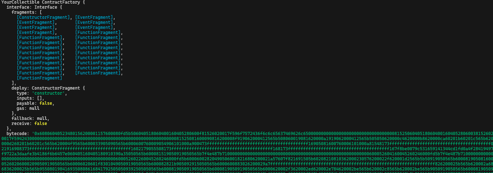
記得先看一下合約地址複製起來
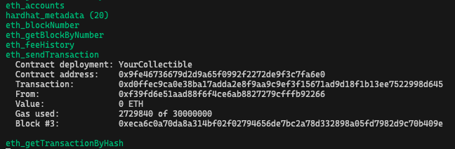

## 測試

首先我們將 Day2 的代碼整理一下 如下

### utils.js

```js
import 'dotenv/config';
import { ethers } from 'ethers';

// 這裡調整一下 getProvder 帶入參數，可切換本地
const getProvder = (local = 'local') => {
	const infuraId = process.env.INFURA_ID;
	let provderUrl = '';
	switch (local) {
		case 'mainnet':
			provderUrl = `https://mainnet.infura.io/v3/${infuraId}`;
			break;
		case 'testnet':
			provderUrl = `https://sepolia.infura.io/v3/${infuraId}`;
			break;
		default:
			provderUrl = 'http://127.0.0.1:8545';
	}

	return new ethers.JsonRpcProvider(provderUrl);
};
// 這裡調整一下 getProvder 帶入參數，可切換本地
// 這個私鑰會在本地啟動所以這裡直接貼上來，但是到網路上建議不要喔！！！
const getSigner = (local = 'local') => {
	const provder = getProvder(local);
	return new ethers.Wallet(
		'0xac0974bec39a17e36ba4a6b4d238ff944bacb478cbed5efcae784d7bf4f2ff80',
		provder
	);
};

export { getProvder, generateWallet, getSigner };
```

### local_contracts.js

```js
import sanfordNFTABI from './abi/NFT.js'; // abi 沿用 Day2，如果真的要自己用的話可以到 /hardhat/artifacts/contracts/YourCollectible.sol/YourCollectible.json 的 abi 去複製
import { ethers } from 'ethers';
import { getProvder, getSigner } from './utils.js';
// 參數設定 local
const localProvider = getProvder('local');
const localSinger = getSigner('local');
const address = await localSinger.getAddress();
const to_address = '0x15d34AAf54267DB7D7c367839AAf71A00a2C6A65';

console.log('address', address);

const myBalance = await localProvider.getBalance(address);

console.log('myBalance', ethers.formatEther(myBalance));

// 傳送交易
const tx = await localSinger.sendTransaction({
	to: to_address,
	value: ethers.parseEther('0.001'), // 這裡記得要轉換成 wei
});

console.log('send tx ', tx);
await tx.wait(); // 等待交易完成

console.log('tx complete');

// 這裡部署好記得去把地址 copy 起來喔。
const sanfordNFTAddress = '0xe7f1725e7734ce288f8367e1bb143e90bb3f0512';

const Contract = new ethers.Contract(
	sanfordNFTAddress,
	sanfordNFTABI,
	localSinger
);
getNFTCurrentId(Contract);

console.log('Mint Start....');
const Tx = await Contract.safeMint(
	await localSinger.getAddress(),
	'https://ipfs.io/ipfs/'
);

console.log('Mint Sucess...');

console.log(Tx.hash);
const url = await Contract.tokenURI(0);
console.log(url);

getNFTCurrentId(Contract);

async function getNFTCurrentId(Contract) {
	const _currentId = await Contract.getCurrent();
	console.log('_currentId', _currentId);
}
```
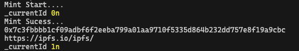


因該都會正常，這樣整個本地開發的步驟就完成了喔！🎉🎉🎉🎉🎉🎉

大概是 Week2-Day3 的簡要紀錄。

影片出處
https://www.youtube.com/watch?v=7EwDOV4nEcY

[⬆️ Day2](../Day2/README.md) \
[🏰 回首頁](../../../README.md)
