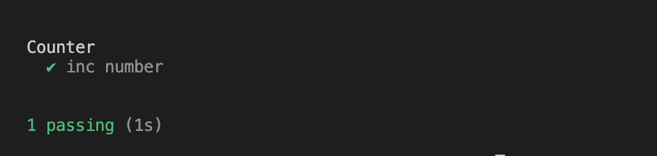
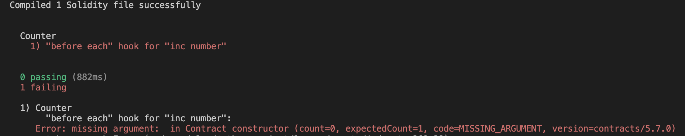
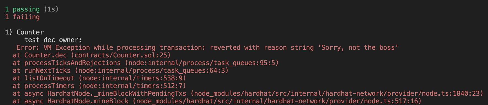
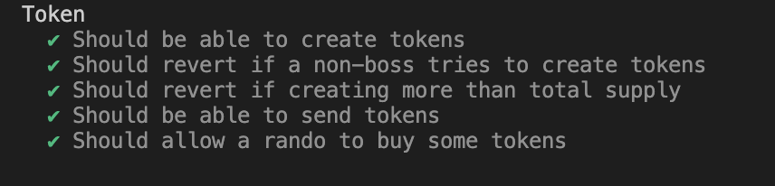

###  Solidity & Testing with Hardhat
###  Solidity & 測試 hardhat
---

一開始是在教學 Remix 一些範例

線上編輯器 [Remix](https://remix.ethereum.org/)


如果你不想在你本地執行可以用線上的非常輕鬆好用

上面範例是開啟一個基本的工作空間，然後還有一些基本的合約可以挑選，開起來之後會有很多的載入程式（非常地好用的 😘😘😘）

開始教學 Solidity 這裡推薦學習的網站

- 私心推薦我自己做的學習筆記 [Solidity 小白學習](https://juniper-pecorino-0ba.notion.site/c2a7d5357bd447c79dabf0cba0a6a394)
- https://github.com/AmazingAng/WTF-Solidity 還是必須推薦 WTF-Solidity 👍👍
- https://solidity-by-example.org/


## hardhat

先建立 hardhat 專案

```js
  npx hardhat
```

/contracts/ 新增 Counter.sol

```js
// SPDX-License-Identifier: MIT
pragma solidity ^0.8.17;

contract Counter {
    uint public count;

    // Function to get the current count
    function get() public view returns (uint) {
        return count;
    }

    // Function to increment count by 1
    function inc() public {
        count += 1;
    }

    // Function to decrement count by 1
    function dec() public {
        // This function will fail if count = 0
        count -= 1;
    }
}

```
編譯一下

```js
  npx hardhat compile
```
⛑️ 這裡可能會出現錯誤，記得先檢查一下目前 hardhat.config.ts 的設定

```js
// 要看一下 pragma solidity ^0.8.17; 版本是否吻合
const config: HardhatUserConfig = {
  solidity: "0.8.18",
};
```

到這個路徑 /artifacts/contracts/Counter.sol/Counter.json 底下看看會編譯出 abi


新增測試檔
/test/Counter.ts
### Counter.ts
```js
import { ethers } from "hardhat";
import { Contract, Signer } from "ethers";
import { expect } from "chai";

describe("Counter", function () {
  let myContract: Contract;
  let owner: Signer;

  beforeEach(async function () {
    const Counter = await ethers.getContractFactory("Counter");
    myContract = await Counter.deploy();
    await myContract.deployed();

    [owner] = await ethers.getSigners();
  });

  it("inc number", async function () {
    expect(await myContract.get()).to.equal(0);
    const incTx = await myContract.inc();
    await incTx.wait();

    expect(await myContract.get()).to.equal(1);
  });
});
```
執行：
`npx hardhat test`
結果如下：


修改合約，增加 constructor \
`說明一下 constructor 的部分，是第一次部署會做什麼事情`


### Counter.sol
```js
// SPDX-License-Identifier: MIT
pragma solidity ^0.8.17;

contract Counter {
    uint256 public count;
    constructor(uint256 _initialCount){
      count = _initialCount;
    }
    // Function to get the current count
    function get() public view returns (uint) {
        return count;
    }

    // Function to increment count by 1
    function inc() public {
        count += 1;
    }

    // Function to decrement count by 1
    function dec() public {
        // This function will fail if count = 0
        count -= 1;
    }
}

```

我們在測試一次，會看到結果是失敗的



改一下測試檔案
### Counter.ts
```js
import { ethers } from "hardhat";
import { Contract, Signer } from "ethers";
import { expect } from "chai";

describe("Counter", function () {
  let myContract: Contract;
  let owner: Signer;

  beforeEach(async function () {
    const Counter = await ethers.getContractFactory("Counter");
    myContract = await Counter.deploy(10);
    await myContract.deployed();

    [owner] = await ethers.getSigners();
  });

  it("inc number", async function () {
    expect(await myContract.get()).to.equal(10);
    const incTx = await myContract.inc();
    await incTx.wait();

    expect(await myContract.get()).to.equal(11);
  });
});
```

`這裡不得不強調，我們是使用測試來保護我們的程式！！（所以測試很重要)`

再試一次～～ OK 成功！！


solidity 基礎變數可以在這邊看看 \
https://docs.soliditylang.org/en/v0.8.20/cheatsheet.html#block-and-transaction-properties

### Counter.sol

新增 boss 權限，只有 boss 才能減 count

```js
// SPDX-License-Identifier: MIT
pragma solidity ^0.8.17;

contract Counter {
    uint256 public count;
    address public boss;

    constructor(uint256 _initialCount){
      count = _initialCount;
      boss = msg.sender;
    }
    // Function to get the current count
    function get() public view returns (uint) {
        return count;
    }

    // Function to increment count by 1
    function inc() public {
        count += 1;
    }

    // Function to decrement count by 1
    function dec() public {
        // This function will fail if count = 0
        require(msg.sender == boss,"Sorry, not the boss");
        count -= 1;
    }
}
```
### Counter.ts
```js

import { ethers } from "hardhat";
import { Contract, Signer } from "ethers";
import { expect } from "chai";

describe("Counter", function () {
  let myContract: Contract;
  let owner: Signer;
  let signer1: Signer;

  beforeEach(async function () {
    const Counter = await ethers.getContractFactory("Counter");
    myContract = await Counter.deploy(10);
    await myContract.deployed();
    console.log('myContract', myContract.address);
    [owner, signer1] = await ethers.getSigners();
  });

  it("inc number", async function () {
    expect(await myContract.get()).to.equal(10);
    const incTx = await myContract.inc();
    await incTx.wait();

    expect(await myContract.get()).to.equal(11);

    expect(await myContract.boss()).to.equal(await owner.getAddress());
  });

  it("test dec owner", async function () {
    //await myContract.connect(signer1).dec()
    await myContract.dec()
  });

});
```
我們可以看到切換帳號是使用 `connect` 這個方法，這個方法是很重要的，因為我們在測試的時候，會需要切換帳號來測試不同的情境 \
`await myContract.connect(signer1).dec()` 來看一下執行結果 🐸



## Error 簡化

上面我們知道了這樣的狀況，學習一下 `modifier` 用法如下

### Counter.sol
```js
// SPDX-License-Identifier: MIT
pragma solidity ^0.8.17;

contract Counter {
    uint256 public count;
    address public boss;

    modifier onlyBoss(){
      require(msg.sender == boss,"Sorry, not the boss");
      _;
    }
    constructor(uint256 _initialCount){
      count = _initialCount;
      boss = msg.sender;
    }
    // Function to get the current count
    function get() public view returns (uint) {
        return count;
    }

    // Function to increment count by 1
    function inc() public {
        count += 1;
    }

    function superInc() public onlyBoss{
        count += 10;
    }

    // Function to decrement count by 1
    function dec() public onlyBoss{
        // This function will fail if count = 0
        count -= 1;
    }
}

```
使用 `await myContract.connect(signer1).dec()` 測試也是失敗的，但我們知道這樣簡化對程式又會更好看了！！！

## Vote

### SanfordToken.sol
```js
// SPDX-License-Identifier: MIT
pragma solidity ^0.8.17;

contract SanfordToken {
    event Buy(address indexed buyer); // 買的時候觸發
    // constant、immutable 這個修飾詞都是不能修改的意思
    // constant 會在編譯時就決定，immutable 則是在部署時決定
    uint256 public constant totalSupply = 1000;
    uint256 public totalCreated = 0;

    uint256 public constant CREATION_PRICE = 0.01 ether;

    address public immutable boss;

    mapping(address => uint256) public balances; // 用 mapping 來記錄每個人的餘額
    // 投票的 struct
    struct Vote {
        address voter;
        bool selection;
    }
    // 投票的 array
    Vote[] public votes;

    constructor() {
        boss = msg.sender; // 第一次部署決定誰是 boss（也就是部署地址）
    }

    modifier onlyBoss() {
        require(msg.sender == boss, "Sorry, not the boss");
        _;
    }

    function create(uint256 quantity) public onlyBoss {
        require(quantity + totalCreated <= totalSupply, "totalSupply reached!");

        balances[msg.sender] += quantity;
        totalCreated += quantity;
    }

    function send(address to, uint256 quantity) public {
        require(balances[msg.sender] >= quantity, "You don't have enough");

        balances[msg.sender] -= quantity;
        balances[to] += quantity;
    }

    function buy() public payable {
        require(msg.value == CREATION_PRICE, "Incorrect ETH amount");
        require(totalCreated < totalSupply, "totalSupply reached!");

        balances[msg.sender] += 1;
        totalCreated += 1;

        emit Buy(msg.sender); // 我們使用 emit 在每次執行完的時候觸發 Buy 事件，並記錄到 Log
    }

    function withdraw() public onlyBoss {
        (bool sent, bytes memory data) = boss.call{value: address(this).balance}("");
        require(sent, "Failed to send Ether");
    }
    // receive 是接收 ETH 的方法(只要有接收都會觸發)
    receive() external payable {

    }
}
```

接下來我們測試一下

```js
import { ethers } from "hardhat";
import { Contract, Signer } from "ethers";
import { expect } from "chai";

describe("Token", function () {
  let token: Contract;
  let signer0: Signer;
  let signer1: Signer;
  beforeEach(async () => {
    const Token = await ethers.getContractFactory("SanfordToken");
    token = await Token.deploy();
    await token.deployed();
    [signer0, signer1] = await ethers.getSigners();
  });

  it("Should be able to create tokens", async function () {

    const createTx = await token.create(100); // 建立 100 個 token
    await createTx.wait();

    expect(await token.balances(signer0.getAddress())).to.equal(100);
  });

  it("Should revert if a non-boss tries to create tokens", async function () {

    const createTx = token.connect(signer1).create(1); // signer1 嘗試建立 1 個 token

    await expect(createTx).to.be.reverted; // 如果不是復原
  });

  it("Should revert if creating more than total supply", async function () {
    const totalSupply = await token.totalSupply();

    const createTx = token.create(totalSupply.add(100));

    await expect(createTx).to.be.reverted;
  });

  it("Should be able to send tokens", async function () {

    const createTx = await token.create(100);
    await createTx.wait();

    expect(await token.balances(signer0.getAddress())).to.equal(100);

    const sendTx = await token.send(signer1.getAddress(), 25);
    await sendTx.wait();

    expect(await token.balances(signer0.getAddress())).to.equal(75);
    expect(await token.balances(signer1.getAddress())).to.equal(25);
  });

  it("Should allow a rando to buy some tokens", async function () {
    const buyTx = await token.connect(signer1).buy({
      value: ethers.utils.parseEther("0.01"),
    });
    await buyTx.wait();

    expect(await token.balances(signer1.getAddress())).to.equal(1);
  });
});
```
結果：




練習這章節的時候感覺比較簡單，可能是自己有學過所以比較輕鬆，但真的要說的話
我們還是必須學會"測試"才能確保我們的合約是沒有問題的，這樣才能讓我們的合約更加安全。

[⬆️ Day3](../Day3/README.md) \
[🏰 回首頁](../../../README.md)