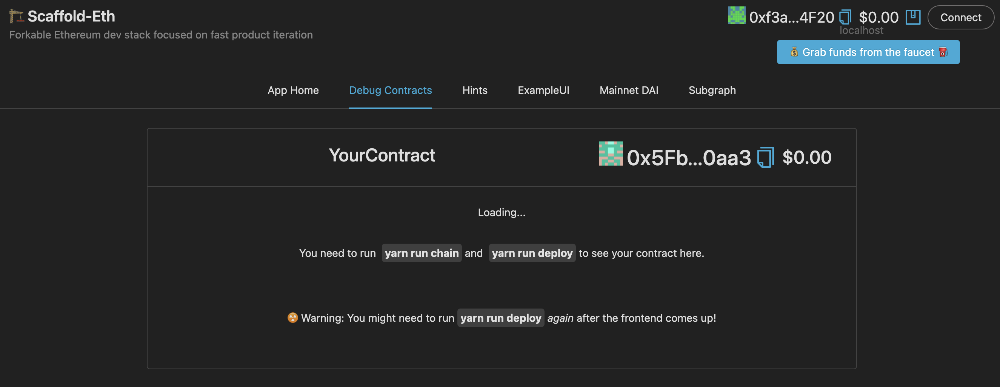
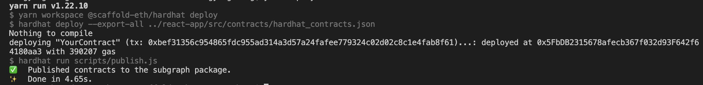
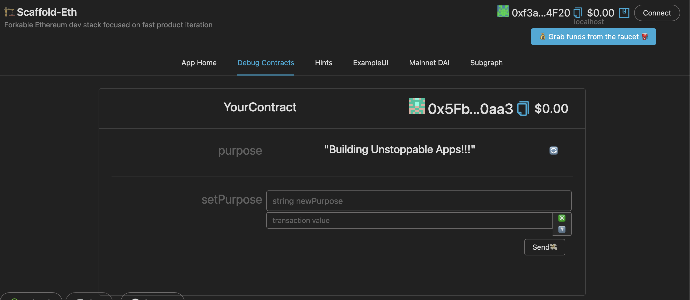
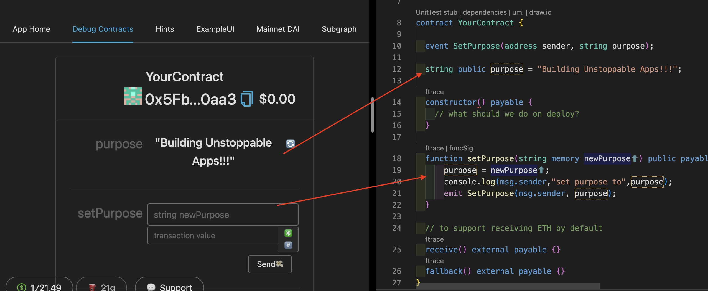
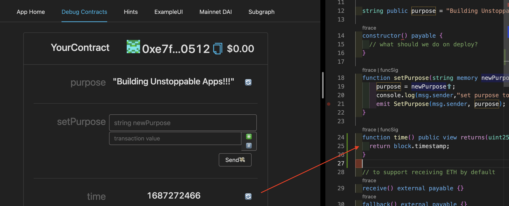
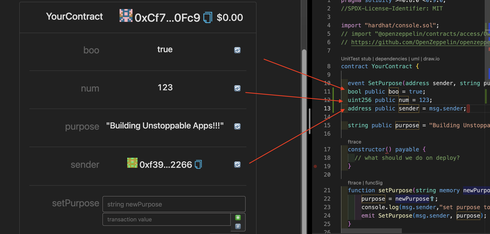
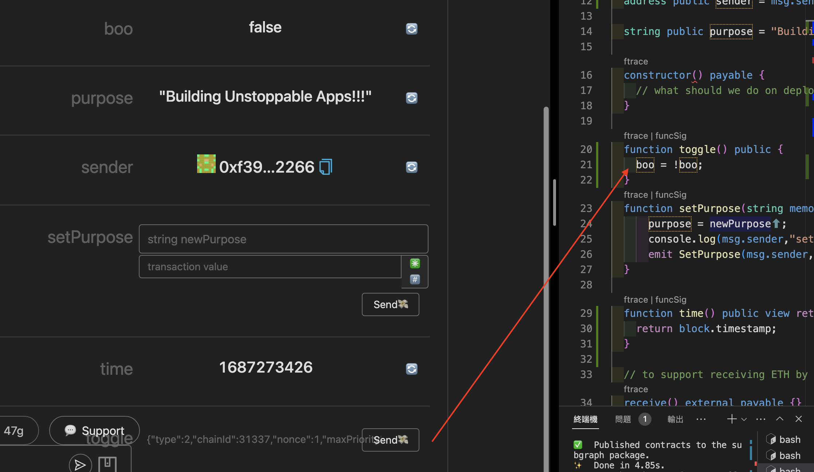

###  🏗 scaffold-eth Introduction and Solidity Recap.
###  腳手架介紹和Solidity回顧
---
Google 搜尋關鍵字 “scaffold-eth” 第一個就是了喔 😹😹😹😹 

https://github.com/scaffold-eth/scaffold-eth

簡單教大家怎麼使用，說明很清楚

建議使用  Node (v18 LTS) 以上

> 1️⃣ clone/fork 🏗 scaffold-eth:

```bash
git clone https://github.com/scaffold-eth/scaffold-eth.git
```

> 2️⃣ install and start your 👷‍ Hardhat chain:

```bash
cd scaffold-eth
yarn install
yarn chain
```
可以很簡便的幫你建立一個 Hardhat chain

這邊補充說明一下 `yarn chain`
```js
"chain": "yarn workspace @scaffold-eth/hardhat chain",
// 可以看到其實他執行了 workspace ，這樣的做法是因為
// 專案比較多複雜模組可以間單分類，而 package.json 也可以簡單管理
// 其中在設定檔中會發現
/*  "workspaces": {
    "packages": [
      "packages/*"
    ],
  }
  這段來設定哪些目錄是要被管理的
*/

```
所以目錄大概是這樣


所以執行了 `yarn chain = yarn workspace @scaffold-eth/hardhat chain`

而執行 `yarn workspace @scaffold-eth/hardhat chain` 會去執行 `packages/hardhat/package.json` 中的 `scripts` 中的 `chain` 這個指令

了解之後就可以直接透過 hardhat 來啟動 chain(本地)

> 3️⃣ 啟動前端
```bash
cd scaffold-eth
yarn start
```
啟動後你可能會看到這樣


其實很好理解請你執行 `yarn run deploy` 說真的超用心
執行

重整一下~可以開始你的練習了

比照一下合約大概就是


> 4️⃣ 進入練習

所以我們快速的測試一下
### 練習一
在 packages/hardhat/contracts/YourContract.sol 中加上
```js
  function time() public view returns(uint256) {
    return block.timestamp;
  }
```
`yarn deploy --reset` 一下，重整網頁 🤪🤪🤪🤪🤪🤪

看呈現出來了！！！

### 練習二 
在 packages/hardhat/contracts/YourContract.sol 中加上
```js
bool public boo = true;
uint256 public num = 123;
address public sender = msg.sender;
```
`yarn deploy --reset` 一下，重整網頁 🤪🤪🤪🤪🤪🤪


### 練習三
在 packages/hardhat/contracts/YourContract.sol 中加上
```js
  function toggle() public {
    boo = !boo;
  }
```
`yarn deploy --reset` 一下，重整網頁連按鈕都可以 🤪🤪🤪🤪🤪🤪
